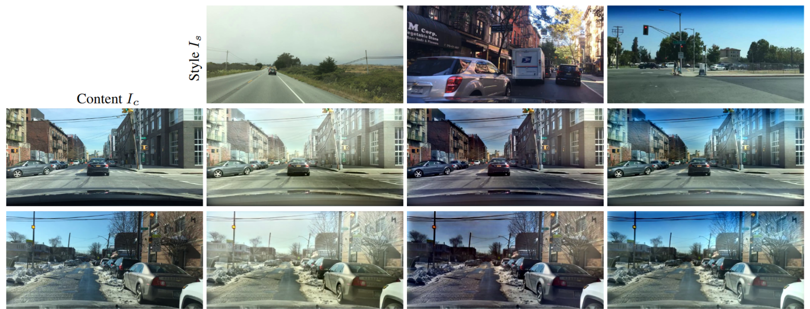
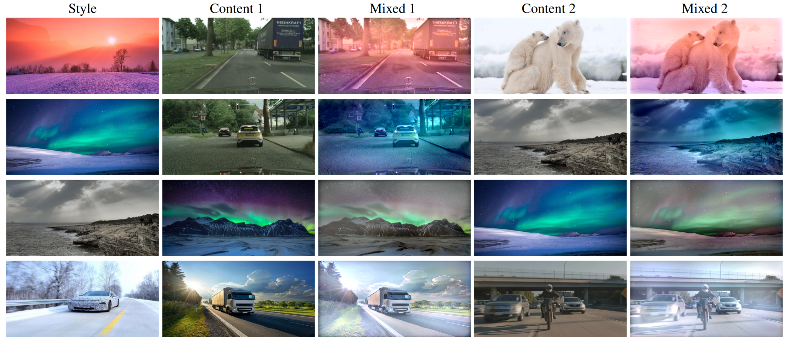

# Intra-Source Style Augmentation for Improved Domain Generalization (ISSA)
Official PyTorch implementation of the WACV 2023 paper ["Intra-Source Style Augmentation for Improved Domain Generalization"](https://arxiv.org/pdf/2210.10175.pdf).  This repository provides the minimal code snippets of the masked noise encoder for GAN inversion. 

**:fire: Updates:**  ["Intra- & Extra-Source Exemplar-Based Style Synthesis for Improved Domain Generalization"](https://link.springer.com/article/10.1007/s11263-023-01878-8) has been accepted at International Journal of Computer Vision (IJCV)!  We extended our WACV paper and add more applications, e.g., utilzing stylized data for assessing domain generalization performance. Please check it out and reach out in case of any questions!   

[](https://arxiv.org/pdf/2210.10175.pdf)  [](https://arxiv.org/pdf/2307.00648.pdf)  [](https://link.springer.com/article/10.1007/s11263-023-01878-8)   


   
   
   


## Getting Started
The code is tested for Python 3.9.
ISSA conda environment can be created via
```
conda env create --file environment.yml
source activate issa
```

## Training
**Note:** please read [how-to.pdf](how-to.pdf) for more detailed instruction. 
After proper path configuration in [configs/mne_training.yml](configs/mne_training.yml), run the command below for training the encoder
```
python train_encoder.py
```
Some important paths need to be adjusted in the configuration file:
- `data`: path to the real data
- `data_fake`: path to the GAN generated data, where the corresponding w latents are stored in the same path
- `pkl_dir`: path to the pretrained GAN model

## Inference
For inference, please refer to the code snippets [here](https://github.com/SnowdenLee/ISSA/blob/a6d191f12f31c92608dd6e50f09d11113a8722b4/train_encoder.py#L428-L438), which shows how the Encoder & Generator are used for image generation.


## Citation
If you use this code please cite

```
@inproceedings{li2023intra,
  title={Intra-Source Style Augmentation for Improved Domain Generalization},
  author={Li, Yumeng and Zhang, Dan and Keuper, Margret and Khoreva, Anna},
  booktitle={Proceedings of the IEEE/CVF Winter Conference on Applications of Computer Vision},
  pages={509--519},
  year={2023}
}

@article{li2023extra,
  title={Intra-\& extra-source exemplar-based style synthesis for improved domain generalization},
  author={Li, Yumeng and Zhang, Dan and Keuper, Margret and Khoreva, Anna},
  journal={International Journal of Computer Vision},
  pages={1--20},
  year={2023},
  publisher={Springer}
}
```


## License

This project is open-sourced under the AGPL-3.0 license. See the
[LICENSE](LICENSE) file for details.

For a list of other open source components included in this project, see the
file [3rd-party-licenses.txt](3rd-party-licenses.txt).


## Purpose of the project

This software is a research prototype, solely developed for and published as
part of the publication cited above. It will neither be
maintained nor monitored in any way.


## Contact
Please feel free to open an issue or contact personally if you have questions, need help, or need explanations. Don't hesitate to write an email to the following email address:
liyumeng07@outlook.com  
